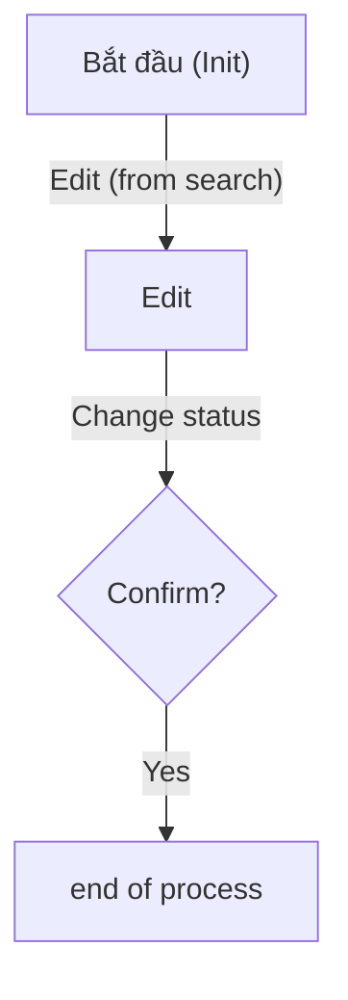
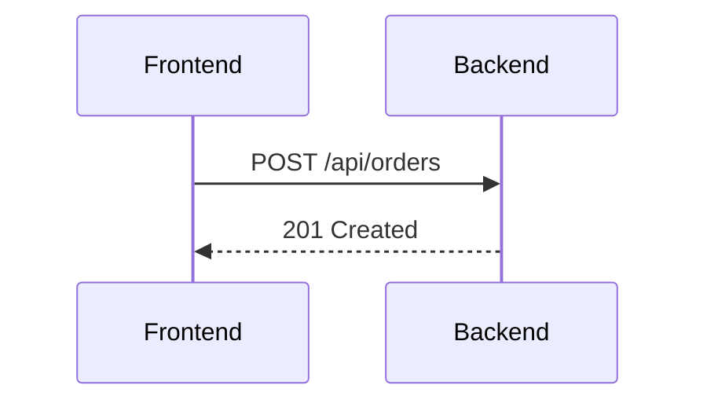

<critical>
scope: creating or editing any Mermaid diagram
rendering: GitHub, VS Code Markdown Preview, mermaid.live
companion: `docs/agent-guide/general/markdown.md` — nested code block wrapping rules
</critical>

<rules section="NEVER">
- use experimental diagram types (`C4Context`, `zenuml`) without explicit approval
- leave labels containing `()`, `,`, `:`, `{}`, Unicode, or reserved words unquoted
- reuse a subgraph ID as a node ID within the same diagram
- use `\n` in labels — use `<br>` instead
- use `->` in sequence diagrams (legacy syntax)
- use deprecated `stateDiagram`
- apply saturated/vivid colors — pastel only
- put emoji inside diagram nodes
</rules>

<rules section="ALWAYS">
- wrap diagrams in ` ```mermaid ` fenced blocks
- first line inside block = diagram type keyword
- `flowchart`: declare direction immediately (`TD` | `LR` | `BT` | `RL`)
- declare all `sequenceDiagram` participants before message flow
- `TD` for vertical phase/process flows; `LR` for pipeline/layer diagrams
- quote edge labels: `|"text"|`
- keep all subgraph IDs and node IDs globally unique within diagram
</rules>

## supported diagram types

| type | keyword | use case | max nodes |
|------|---------|----------|-----------|
| Flowchart | `flowchart` | process flows, decision trees | 15 |
| Sequence | `sequenceDiagram` | component interactions, API calls | 10 |
| Class | `classDiagram` | object models, interfaces | 12 |
| State | `stateDiagram-v2` | state machines, lifecycle | 8 |
| ER | `erDiagram` | DB schemas, entity relationships | 10 |
| Gantt | `gantt` | project timelines | 20 |
| Pie | `pie` | proportional data | 6 |
| Git Graph | `gitGraph` | branching strategies | 15 |
| User Journey | `journey` | UX flows | 10 |
| Mindmap | `mindmap` | topic hierarchies | 3 levels |
| Timeline | `timeline` | chronological sequences | 10 events |

## §M1 block declaration

- first line inside ` ```mermaid ` block: diagram type keyword
- `flowchart`: declare direction immediately (`TD`, `LR`, `BT`, `RL`)

## §M2 quoting labels

Quote node, edge, and subgraph labels containing: `()`, `,`, `:`, `{}`, Unicode, reserved words (`end`, `and`, `or`).
Edge labels: `|"text"|`. Multi-line labels: `<br>`.

<example type="quoted_labels">
✅

❌ Unquoted labels with `()`, Unicode, or `end` cause parse errors.
</example>

## §M3 subgraph ID uniqueness

Never reuse a subgraph ID as a node ID — causes cycle parse error.

<example type="subgraph_id">
✅ subgraph `Phase3`; node inside: `collect["Thu thập kết quả"]`
❌ subgraph `Phase3`; node inside: `Phase3["Thu thập kết quả"]`
</example>

## §M4 sequence diagrams

- declare all participants with `participant` before any message flow
- `->>` for synchronous calls; `-->>` for return messages

<example type="sequence_diagram">
✅

</example>

## §M5 ER diagrams — cardinality notation

| symbol | meaning |
|--------|---------|
| `\|\|` | Exactly one |
| `o\|` | Zero or one |
| `\|\{` | One or more |
| `o\{` | Zero or more |

## §M6 state diagrams

Use `stateDiagram-v2`. Transitions: `-->`. Transition labels: `: label`.

## §M7 visual style

### §M7.1 principles

| principle | rule |
|-----------|------|
| colors | pastel only — no saturated/vivid fills |
| semantic consistency | same color = same meaning across all diagrams |
| labels | max 6 words per line; `<br>` to break long labels |
| emoji | only in prose, not inside nodes |
| direction | `TD` for process flows; `LR` for pipeline/layer |
| minimal color | apply only when ≥5 nodes or semantic distinction needed |

### §M7.2 semantic color palette

| role | fill | stroke | meaning |
|------|------|--------|---------|
| `process` | `#e8f4fd` | `#5ba3c9` | normal processing step |
| `decision` | `#fefce8` | `#c9a83c` | branch / condition |
| `terminal` | `#edfaf1` | `#5ab07a` | start / end / success |
| `warning` | `#fff4e6` | `#c97a3c` | warning — processing continues |
| `error` | `#fdf0f0` | `#c96060` | error — blocks processing |
| `external` | `#f5f5f5` | `#aaaaaa` | external actor / system |

`warning` (orange) and `error` (red) are distinct severities — keep them visually separate, never collapse into one color.

### §M7.3 implementation

Global baseline via `%%{init}%%` at diagram top:

```mermaid
%%{init: {'theme': 'base', 'themeVariables': {'primaryColor': '#e8f4fd', 'primaryBorderColor': '#5ba3c9', 'primaryTextColor': '#1a3a4a', 'lineColor': '#5ba3c9', 'background': '#ffffff', 'fontFamily': 'sans-serif'}}}%%
```

Flowchart — semantic colors via `classDef`:

```mermaid
flowchart TD
    classDef process  fill:#e8f4fd,stroke:#5ba3c9,color:#1a3a4a
    classDef decision fill:#fefce8,stroke:#c9a83c,color:#4a3a00
    classDef terminal fill:#edfaf1,stroke:#5ab07a,color:#1a3a28
    classDef warning  fill:#fff4e6,stroke:#c97a3c,color:#4a2800
    classDef error    fill:#fdf0f0,stroke:#c96060,color:#4a1a1a
    classDef external fill:#f5f5f5,stroke:#aaaaaa,color:#444444
```

Apply with `:::className` — e.g., `A["Validate"]:::process`, `B{"OK?"}:::decision`.

Flowchart — node shapes:

| shape | syntax | use |
|-------|--------|-----|
| Rectangle | `["label"]` | process step |
| Stadium | `(["label"])` | start / end / terminal |
| Diamond | `{"label"}` | decision / condition |
| Cylinder | `[("label")]` | database / storage |
| Subroutine | `[["label"]]` | subprocess / linked flow |

Flowchart — arrows:

| arrow | syntax | use |
|-------|--------|-----|
| Solid | `-->` | main flow |
| Dashed | `-.->` | optional / async / side path |
| Labeled | `-->|"label"|` | branch condition |

Subgraph backgrounds:

| type | fill | stroke |
|------|------|--------|
| Phase | `#f0f7ff` | `#7ab3d4` |
| Layer | `#f7f0ff` | `#9b7abf` |
| External | `#fafafa` | `#bbbbbb` |

## §2 checklist

- [ ] diagram type: supported, not experimental (§M1)
- [ ] special-char labels: quoted (§M2)
- [ ] no node ID same as enclosing subgraph ID (§M3)
- [ ] sequence: participants declared first (§M4)
- [ ] ER: official cardinality notation (§M5)
- [ ] `stateDiagram-v2` not deprecated `stateDiagram` (§M6)
- [ ] colors: pastel only (§M7.1)
- [ ] same role = same color throughout (§M7.2)
- [ ] labels: max 6 words, no emoji in nodes (§M7.1)
- [ ] direction: `TD` process, `LR` pipeline/layer (§M7.1)
- [ ] `classDef` only when ≥5 nodes or semantic distinction needed (§M7.3)

## §3 common parse errors

| error | cause | fix |
|-------|-------|-----|
| `Expecting..., got 'PS'` | unquoted edge label | `-->|"label"|` |
| `Unexpected token \n` | `\n` in label | use `<br>` |
| `Unexpected token end` | reserved word unquoted | `["end"]` or rename |
| `Parse error on line X` | invalid ID or syntax | check ID format; quote labels |
| `Setting X as parent of X` | node ID = subgraph ID | rename node (§M3) |

## scope exclusions

code comments, config files (YAML/JSON), user-provided content, tool output/logs.

<critical_recap>
1. quote all labels containing `()`, `,`, `:`, `{}`, Unicode, or reserved words
2. never reuse subgraph ID as node ID within the same diagram
3. declare all participants before message flow in sequence diagrams
4. pastel colors only; same semantic role = same color throughout
5. `TD` for process flows, `LR` for pipeline/layer; `stateDiagram-v2` not `stateDiagram`
</critical_recap>
